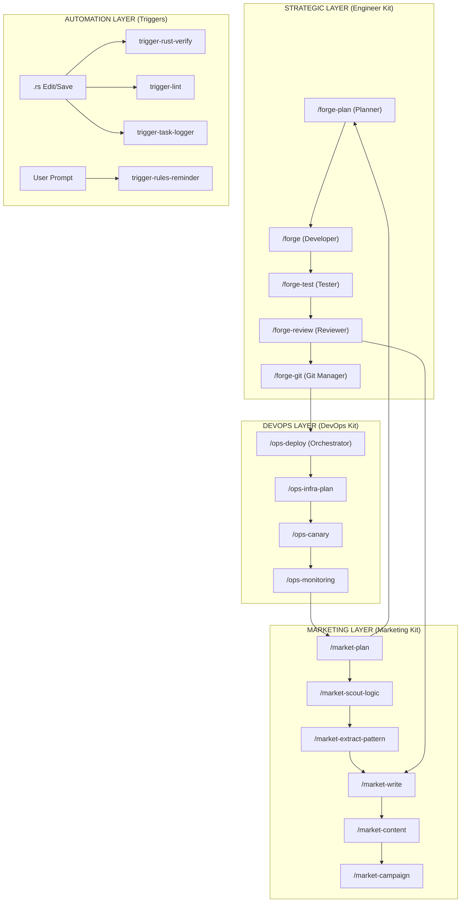

# Caesar Nexus System Topology (Map Route)

> High-fidelity visualization of the integrated 70-agent swarm and 100+ strategic workflows. 

## I. Global Orchestration Map

## II. Key Handoff Logic ("Ruột")

### 1. Engineer → DevOps (The Deploy Loop)
- **Node**: `/forge` (Phase 7) → `/ops-deploy`.
- **Constraint**: Deployment only proceeds if code quality score is ≥ 9.5 and all TDD suites pass.
- **Trigger**: `trigger-rust-verify` acts as the gatekeeper.

### 2. Marketing → Engineer (The ROI Loop)
- **Node**: `/market-data-analytics` → `/forge-plan`.
- **Constraint**: New features are prioritized based on LTV and Revenue Forecast metrics.
- **Trigger**: `trigger-market-intel-sync`.

### 3. Intel → Content (The Clone Loop)
- **Node**: `/market-scout-logic` → `/market-extract-pattern` → `/market-write`.
- **Logic**: Strategic DNA is dismantled, distilled, and synthesized into high-conversion copy within the same hour.

## III. Status Dashboard
- **Total Agents**: 70 (Verified ✅)
- **Total Commands**: 70+ (Verified ✅)
- **Total Workflows**: 79 (Active ✅)
- **Trigger Gates**: 10 (Operational ✅)
